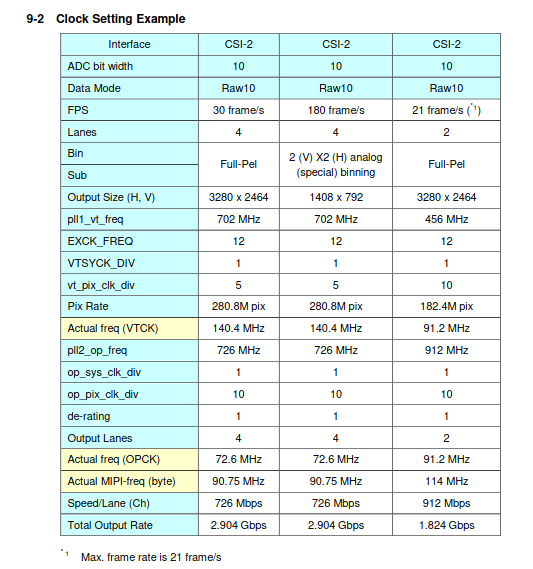

# Open Source MIPI CSI 2 Core 

# relevant FPGA Specs for MIPI CSI2

## Lattice ECP5
  -IDDRX2F Inputs up to 800Mbits/s per Lane at best Speed Grade
   https://www.latticesemi.com/-/media/LatticeSemi/Documents/DataSheets/ECP5/FPGA-DS-02012-2-8-ECP5-ECP5G-Family-Data-Sheet.ashx?document_id=50461 S.67

  -No 1:8 Deserialisation possible max at 1:4 with IDDRX2F

  -more possible with Lattice SERDES Primitives
   

## Spartan 7  
  -ISerdes Inputs up to 1250Mbits/s per Lane at best Speed Grade
   https://www.google.com/url?sa=t&rct=j&q=&esrc=s&source=web&cd=&cad=rja&uact=8&ved=2ahUKEwiz9qvp4dj-AhWpwQIHHZipAqsQFnoECAwQAQ&url=https%3A%2F%2Fdocs.xilinx.com%2Fr%2Fen-US%2Fds189-spartan-7-data-sheet&usg=AOvVaw1EquHW1x9nMGJjTvGVS6tl S.13

   -1:8 Deserialisation possible

   -Spartan 7 has no Gigabyte Transceivers for higher Data Rates

## Artix 7
  -ISerdes Inputs up to 1250Mbits/s per Lane at best Speed Grade
    https://www.google.com/url?sa=t&rct=j&q=&esrc=s&source=web&cd=&cad=rja&uact=8&ved=2ahUKEwj969rl4tj-AhXKyKQKHSzqAy0QFnoECAoQAQ&url=https%3A%2F%2Fdocs.xilinx.com%2Fv%2Fu%2Fen-US%2Fds181_Artix_7_Data_Sheet&usg=AOvVaw1r_7Zb1cVcwyQMajp2tdKU S.15

   -1:8 Deserialisation possible

   -Artix 7 has  Gigabyte Transceivers for higher Data Rates

## Kintex 7
  -ISerdes Inputs up to 1600Mbits/s at HP IOBank 1250Mbits/s at HR IOBANK per Lane at best Speed Grade
    https://docs.xilinx.com/v/u/en-US/ds182_Kintex_7_Data_Sheet S.14

   -1:8 Deserialisation possible

   -Kintex 7 has  Gigabyte Transceivers for higher Data Rates

## Virtex 7
  -ISerdes Inputs up to 1600Mbits/s at HP IOBank 1250Mbits/s at HR IOBANK per Lane at best Speed Grade
    https://docs.xilinx.com/v/u/en-US/ds182_Kintex_7_Data_Sheet S.14

   -1:8 Deserialisation possible

   -Virtex 7 has  Gigabyte Transceivers for higher Data Rates

# Comparison with MIPI CSI Cameras

## OV5647-Raspberry Cam v1 

## IMX219-Raspberry Cam v2 

## IMX708-Raspberry Cam v3

## IMX283

## IMX294